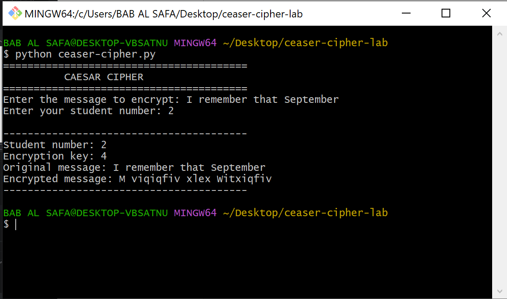

# Caesar Cipher - Cybersecurity Lab 1

## Cybersecurity and Information Protection

**Laboratory 1:** Monoalphabetic Replacement Cipher (Caesar's Cipher)

**University:** The John Paul II Catholic University of Lublin
**Faculty:** Faculty of Philosophy and Informatics
**Academic Year:** 2026/2027
**Student:** Amiraoui Ahmed Imed Eddine
**Student Number:** 2

---

## 1. Project Description

This project implements the Caesar cipher, a classical monoalphabetic substitution cipher.

The Caesar cipher encrypts a message by shifting each letter of the English alphabet by a fixed number of positions.

For this laboratory, the encryption key is calculated according to:

```text
key = 2 × student number
```

Since my student number is 2:

```text
key = 2 × 2 = 4
```

Therefore, the program uses an encryption key of **4**.

---

## 2. How the Caesar Cipher Works

Each letter is shifted to the right by the encryption key.

For example, with key = 4:

```text
A → E
B → F
C → G
D → H
...
W → A
X → B
Y → C
Z → D
```

The program uses modulo 26 to handle the alphabet wrap-around.

For example:

```text
W = 22

(22 + 4) % 26 = 0

0 = A
```

Therefore:

```text
W → A
```

Spaces, numbers, and punctuation are kept unchanged.

---

## 3. Features

The program:

* Encrypts English text using the Caesar cipher
* Supports uppercase letters
* Supports lowercase letters
* Preserves spaces
* Preserves numbers
* Preserves punctuation
* Calculates the key from the student's number
* Uses modulo 26 for alphabet wrapping

---

## 4. Encryption Key

Student number:

```text
2
```

According to the laboratory instructions:

```text
key = 2 × student number
```

Therefore:

```

---

## 5. Example

### Input

```text
Message: I remember that September
Student number: 2
```

### Encryption Key

```text
4
```

### Output


The program encrypts the message using a Caesar shift of 4.

---

## 6. Technologies

* Python 3
* Caesar Cipher
* Classical Cryptography
* Modular Arithmetic

No external Python libraries are required.

---

## 7. How to Run

Clone the repository:


```bash
git clone https://github.com/ahmedimed/caesar-cipher-lab.git
```

Enter the project directory:

```bash
cd caesar-cipher-lab
```

Run the program:

```bash
python caesar-cipher.py
```

Then enter the message and your student number when prompted.

---

## 8. Project Structure

```text
caesar-cipher-lab/
│
├── caesar-cipher.py

├── README.md
└── Running.PNG
```

---

## 9. Screenshot

Example of the program running:



---

## 10. Learning Objectives

This laboratory demonstrates:

* The basic principles of classical encryption
* Monoalphabetic substitution
* Caesar cipher implementation
* Character manipulation in Python
* Modular arithmetic
* Basic cryptographic concepts
* Python input and output handling

---

## 11. Security Note

The Caesar cipher is not considered secure for modern applications.

There are only 25 possible non-zero shifts, making the cipher vulnerable to brute-force attacks.

It is mainly useful for learning the fundamental concepts of classical cryptography.

---

## Author

**Amiraoui Ahmed Imed Eddine**

Cybersecurity and Information Protection
The John Paul II Catholic University of Lublin
2026

